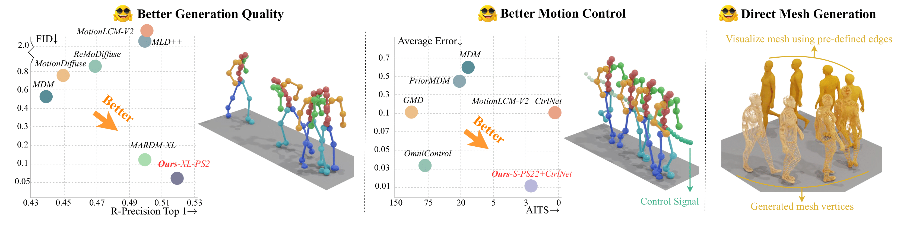

# Absolute Coordinates Make Motion Generation Easy (arXiv 2025)


<p align="center">
  <a href='https://arxiv.org/abs/2505.19377'>
    
  </a>
  <a href='https://arxiv.org/abs/2505.19377.pdf'>
    
  </a>
  <a href='https://neu-vi.github.io/ACMDM/'>
  </a>
  <a href='https://github.com/neu-vi/ACMDM'>
    </a>
  <a href="" target='_blank'>
    
  </a>
</p>

<p align="center">
<strong>Absolute Coordinates Make Motion Generation Easy</strong></h1>
   <p align="center">
    <a href='https://cr8br0ze.github.io' target='_blank'>Zichong Meng</a>&emsp;
    <a href='https://show-han.github.io/' target='_blank'>Zeyu Han</a>&emsp;
    <a href='https://xiaogangpeng.github.io/' target='_blank'>Xiaogang Peng</a>&emsp;
    <a href='https://ymingxie.github.io/' target='_blank'>Yiming Xie</a>&emsp;
    <a href='https://jianghz.me/' target='_blank'>Huaizu Jiang</a>&emsp;
    <br>
    Northeastern University 
    <br>
    arXiv 2025
  </p>
</p>

### Official Simple & Minimalist PyTorch Implementation

#### It's quite a rush for me to clean all of the codes. Please let me know if I made any mistakes in the code. Also, I forgot to upload ACMDM-XL-PS2 to G-Drive, will also try to update that as well :).
#### I will also be writing a blog about MARDM and ACMDM :).

## 📜 TODO List
- [x] Release the clean code for joint level motion generation
- [x] Release the clean code for controllable motion generation
- [x] Release the clean code for mesh level motion generation
- [x] Release the evaluation codes and the pretrained models
- [ ] Release the data process code for mesh level motion

##  ⚙️ Getting Started
<details>
  
### 1. Conda Environment
```bash
conda env create -f environment.yml
conda activate ACMDM
```
We test our code on Python 3.10.13, PyTorch 2.2.0, and CUDA 12.1

### 2. Models and Dependencies

#### Download Evaluation Models
```bash
rm -rf checkpoints
mkdir checkpoints
cd checkpoints
mkdir t2m

cd t2m 
echo -e "Downloading evaluation models for HumanML3D dataset"
gdown --fuzzy https://drive.google.com/file/d/1ejiz4NvyuoTj3BIdfNrTFFZBZ-zq4oKD/view?usp=sharing
echo -e "Unzipping humanml3d evaluators"
unzip evaluators_humanml3d.zip

echo -e "Cleaning humanml3d evaluators zip"
rm evaluators_humanml3d.zip
cd ../../
```

#### Download SMPL-H and DMPLs Models
Download SMPL+H mode from [SMPL+H](https://mano.is.tue.mpg.de/download.php) (choose Extended SMPL+H model used in AMASS project) and DMPL model from [DMPL](https://smpl.is.tue.mpg.de/download.php) (choose DMPLs compatible with SMPL). Then place all the models under "./body_model/".

#### Download GloVe
```bash
rm -rf glove
echo -e "Downloading glove (in use only by the evaluators)"
gdown --fuzzy https://drive.google.com/file/d/1cmXKUT31pqd7_XpJAiWEo1K81TMYHA5n/view?usp=sharing

unzip glove.zip
echo -e "Cleaning GloVe zip\n"
rm glove.zip

echo -e "Downloading done!"
```

#### Download Pre-trained Models
```bash
cd checkpoints/t2m
echo -e "Downloading pretrained models for HumanML3D dataset"
# Joint Level
# 2D Causal AE
gdown --fuzzy https://drive.google.com/file/d/1MdGC2ioAwbcfIBJgXCuXFFaWiNLEIPkN/view?usp=drive_link
# ACMDM-S-PS22
gdown --fuzzy https://drive.google.com/file/d/1G0g1-K9oGJPxz-vcmnLNfg5jNpQN4Iho/view?usp=drive_link
# ACMDM-S-PS22 Prefix AR
gdown --fuzzy https://drive.google.com/file/d/1Dpf70qpVOAEggKRrSE97q9ZaRnWhrEsS/view?usp=drive_link
# ACMDM-S-PS22 Noisy Prefix AR
gdown --fuzzy https://drive.google.com/file/d/1TbmicpGFmIpUtaWN6MWFX4Ki9u87alLU/view?usp=drive_link
# Controls
# ACMDM-S-PS22-ControlNet
gdown --fuzzy https://drive.google.com/file/d/1q2qhYVMZgj2A7s__HBaS-k5pl0URtk8K/view?usp=drive_link
# Mesh Level
# Mesh AE
gdown --fuzzy https://drive.google.com/file/d/1RndgH9PSLUJbSDd1cfo4UDOYBdjj7lqV/view?usp=drive_link
# ACMDM-S-PS28 Mesh
gdown --fuzzy https://drive.google.com/file/d/1H72A5flgx0we5QcRoBf_YqIOfkZRngC5/view?usp=drive_link
# Length Estimator
gdown --fuzzy https://drive.google.com/file/d/1nWoEcN4rEFKi4Xyf_ObKinDmSQNPKXgU/view?usp=drive_link
echo -e "Unzipping"
unzip AE_2D_Causal.zip
unzip ACMDM_Flow_S_PatchSize22.zip
unzip ACMDM_PrefixAR_Flow_S_PatchSize22.zip
unzip ACMDM_NoisyPrefixAR_Flow_S_PatchSize22.zip
unzip ACMDM_Flow_S_PatchSize22_ControlNet.zip
unzip AE_Mesh.zip
unzip ACMDM_Mesh_Flow_S_PatchSize28.zip
unzip length_estimator.zip
echo -e "Cleaning zips"
rm AE_2D_Causal.zip
rm ACMDM_Flow_S_PatchSize22.zip
rm ACMDM_PrefixAR_Flow_S_PatchSize22.zip
rm ACMDM_NoisyPrefixAR_Flow_S_PatchSize22.zip
rm ACMDM_Flow_S_PatchSize22_ControlNet.zip
rm AE_Mesh.zip
rm ACMDM_Mesh_Flow_S_PatchSize28.zip
rm length_estimator.zip
cd ../../
```

### 3. Obtain Data
**You do not need to get data** if you only want to generate motions based on textual instructions.

### 3.1 Joint level Motion Generation and Control
If you want to reproduce and evaluate our method, you can obtain 
**HumanML3D** dataset following instructions in [HumanML3D](https://github.com/EricGuo5513/HumanML3D.git). By default, the data path is set to `./datasets`.

**Important:** For absolute coordinate Mean and Std, you are welcome to use the 22x3_mean_std/22x3_mean.npy and 22x3_mean_std/22x3.npy in the utils,
or you can calculate based on your obtained dataset using:
```
python utils/cal_22x3_mean_std.py
```

### 3.2 Mesh level Motion Generation
I will create a new repo specifically for the mesh level motion data. **Link to be posted**
</details>


## 💻  Demo
<details>

### 1. Text-to-Motion Generation
To be implemented

[//]: # (#### &#40;a&#41; Generate with single textual instruction)

[//]: # (```bash)

[//]: # (python sample.py --name MARDM_SiT_XL --text_prompt "A person is running on a treadmill.")

[//]: # (```)

[//]: # (#### &#40;b&#41; Generate from a prompt file)

[//]: # (in a txt file, in each line, your input should be `<text description>#<motion length>`,)

[//]: # (you can push NA as motion length to let model determine the motion length)

[//]: # (&#40;if there is **one** NA in file, all the others will be **NA** as well&#41;.)

[//]: # ()
[//]: # (```bash)

[//]: # (python sample.py --name MARDM_SiT_XL --text_path ./text_prompt.txt)

[//]: # (```)

### 2. Controllable Text Driven Motion Generation
To be implemented
### 3. Direct SMPL-H Mesh Vertices Motion Generation
To be implemented
</details>


## 🎆 Train Your Own ACMDM models
<details>

### Joint Level
#### 2D Causal AE
```bash
python train_AE.py --name AE_2D_Causal --is_ae --dataset_name t2m --batch_size 256 --epoch 50 --lr_decay 0.05 --accum 2
```

#### ACMDM
Before training ACMDM, please make sure you obtain the post AE mean and post AE std by running this command (if you are using the provided AE, you do not have to do this):
```bash
PYTHONPATH=. python utils/cal_ae_post_mean_std.py --is_ae --ae_name AE_2D_Causal
```
Training ACMDM
```bash
# 2D Causal AE
python train_ACMDM.py --name ACMDM_Flow_S_PatchSize22 --model "ACMDM-Flow-S-PatchSize22" --dataset_name t2m --batch_size 64 --ae_name AE_2D_Causal --is_ae
# Raw 22x3
python train_ACMDM_Raw.py --name ACMDM_Raw_Flow_S_PatchSize22 --model "ACMDM-Raw-Flow-S-PatchSize22" --dataset_name t2m --batch_size 64
# Prefix AR
python train_ACMDM_Prefix_AR.py --name ACMDM_PrefixAR_Flow_S_PatchSize22 --model "ACMDM-PrefixAR-Flow-S-PatchSize22" --dataset_name t2m --batch_size 64 --ae_name AE_2D_Causal --is_ae
# Noisy Prefix AR
python train_ACMDM_NoisyPrefix_AR.py --name ACMDM_NoisyPrefixAR_Flow_S_PatchSize22 --model "ACMDM-NoisyPrefixAR-Flow-S-PatchSize22" --dataset_name t2m --batch_size 64 --ae_name AE_2D_Causal --is_ae
```

### Controls
Assuming you already trained or obtained the AE model.
```bash
# pelvis only
python train_ACMDM_Control.py --name ACMDM_Flow_S_PatchSize22_ControlNet --model "ACMDM-Flow-S-PatchSize22-ControlNet" --dataset_name t2m --batch_size 64 --ae_name AE_2D_Causal --is_ae --control_joints 0
# all joints
python train_ACMDM_Control.py --name ACMDM_Flow_S_PatchSize22_ControlNet --model "ACMDM-Flow-S-PatchSize22-ControlNet" --dataset_name t2m --batch_size 64 --ae_name AE_2D_Causal --is_ae
```

### Mesh Level
#### Mesh AE
```bash
python train_AE_Mesh.py --name AE_Mesh --dataset_name t2m --batch_size 16 --epoch 500 --window_size 1 --lr 5e-5
```
Before training ACMDM, please obtain and save latent version of the data first, this makes diffusion training much faster,
and please obtain the post AE mean and post AE std by running this command (if you are using the provided AE, you do not have to do this):
```bash
# hope this is right, will check.
PYTHONPATH=. python utils/cal_mesh_ae_post_mean_std.py
```
Training ACMDM
```bash
python train_ACMDM_Mesh.py --name ACMDM_Mesh_Flow_S_PatchSize28-222 --ae_name AE_Mesh --model "ACMDM-Mesh-Flow-S-PatchSize28" --dataset_name t2m --batch_size 64 --is_ae
```

</details>

## 📖 Evaluate ACMDM models
<details>

### Joint Level
#### 2D Causal AE
```bash
python evaluation_AE.py --name AE_2D_Causal --dataset_name t2m
```
#### ACMDM
```bash
# ACMDM S PS22
python evaluation_ACMDM.py --name ACMDM_Flow_S_PatchSize22 --model "ACMDM-Flow-S-PatchSize22" --ae_name AE_2D_Causal --cfg 3
# ACMDM XL PS2
python evaluation_ACMDM.py --name ACMDM_Flow_XL_PatchSize2 --model "ACMDM-Flow-XL-PatchSize2" --ae_name AE_2D_Causal --cfg 3
# ACMDM Prefix AR
python evaluation_ACMDM_Prefix_AR.py --name ACMDM_PrefixAR_Flow_S_PatchSize22 --model "ACMDM-PrefixAR-Flow-S-PatchSize22" --ae_name AE_2D_Causal --cfg 4
# ACMDM Noisy Prefix AE
python evaluation_ACMDM_Noisy_Prefix_AR.py --name ACMDM_NoisyPrefixAR_Flow_S_PatchSize22 --model "ACMDM-NoisyPrefixAR-Flow-S-PatchSize22" --cfg 2.5
```
### Controls
```bash
python evaluation_ACMDM_Control.py --name ACMDM_Flow_S_PatchSize22_ControlNet-222 --model "ACMDM-Flow-S-PatchSize22-ControlNet" --dataset_name t2m --batch_size 64 --ae_name AE_2D_Causal --is_ae
```

### Mesh
```bash
python evaluation_ACMDM_Mesh.py --name ACMDM_Mesh_Flow_S_PatchSize28 --model "ACMDM-Mesh-Flow-S-PatchSize28" --ae_name AE_Mesh --cfg 4.5
```
</details>


## 🤔 Some Thoughts
### AutoEncoders
1. **AE v.s. VAE**: Theoretically, VAE was supposed to be a better choice than AE because of the **tolerance of errors** during the decoding stage (i.e. VAE is **many to one** v.s. AE is **one to one** during decoding).
I think AE is better in this project is mainly because it's HumanML3D dataset where **data quantity** are not as many as image generation datasets (20k vs 1M).
2. Causal v.s. Non Causal: Causa AE seams to outperform mainly because None Causal AE (convolutional) have a **big problem** when data input are **variable length**.
For example, the latent you get from input of length 120 and pad zeros to 196 (what we usually do in training) is very different from the latent you get from same input of length 120 no padding.
This may make a mismatch in second stage diffusion training and inference, and many (90%) of the generated last 4 frame is wrong because of this.
(But Causal AE may not be perfect as well even though Causal AE does not have this variable length decoding problem, but in a few times the first 4 frame contained a shift)
### Diffusions
1. Flow Matching are so much **easy to train** compared to DDPM methods. From my experience, it converges so much faster and because of using ODE-solver it's also faster in inference.
2. Raw Joint is not too bad of a choice, but latent ones seams to converge faster. I think this is mainly because of data distribution
(latent distribution may be more well distributed while raw joints, for different joints, the **range will be relatively narrow** (for example human foot will most likely be around that small narrow range around ground on xyz axis.)). Maybe training on raw joints data for more steps (other motion diffusion models usually train for like 65k we train for 20k) and larger model size can probably help. 
But a tradeoff is AE downsampled the input which makes larger model training faster and computationally more feasible. 
### Representations
1. Not thinking humans are human but to model absolute coordinates opens the door to modeling various type of human representations,
which is not limit to just **joint coordinates**, **mesh vertices coordinates**, but may also include **point clouds**, **voxels** (another form of absolute coordinates in fix grid, maybe unified human/object/scene/crowd motion generations?), **etc**, which may have even more potential than what we see in this project. 
### Thoughts Continues...

## 🍀 Acknowledgments
This code is standing on the shoulders of giants, we would like to thank the following contributors that our code is based on:.

Our original raw implementation is heavily based on [T2M](https://github.com/EricGuo5513/text-to-motion),
[T2M-GPT](https://github.com/Mael-zys/T2M-GPT), [MMM](https://github.com/exitudio/MMM) 
and [MoMask](https://github.com/EricGuo5513/momask-codes).
The Diffusion part is primarily based on [DDPM](https://github.com/hojonathanho/diffusion),
[DiT](https://github.com/facebookresearch/DiT), [SiT](https://github.com/willisma/SiT),
[MAR](https://github.com/LTH14/mar/), [HOI-Diff](https://github.com/neu-vi/HOI-Diff),
[InterGen](https://github.com/tr3e/InterGen), [MDM](https://github.com/GuyTevet/motion-diffusion-model),
[MLD](https://github.com/ChenFengYe/motion-latent-diffusion), [OmniCOntrol](https://github.com/neu-vi/omnicontrol), [DiP](https://github.com/GuyTevet/CLoSD).

For open sourced version, we decide to restructure (and some rewrite) for a simple and minimalist version of PyTorch code implementation
that get rids of PyTorch Lighting implicit hooks, outer-space variable utilization and implicit argparse calls.
We hope our minimalist version implementation can lead to better code comprehension and contribution to the motion generation community. Thank you.

## 🤝 Citation
If you find this repository useful for your work, please consider citing it as follows:
```bibtex
@article{meng2025absolute,
    title={Absolute Coordinates Make Motion Generation Easy},
    author={Meng, Zichong and Han, Zeyu and Peng, Xiaogang and Xie, Yiming and Jiang, Huaizu},
    journal={arXiv preprint arXiv:2505.19377},
    year={2025}
  }
```

## Star History

[](https://star-history.com/#neu-vi/ACMDM&Date)
